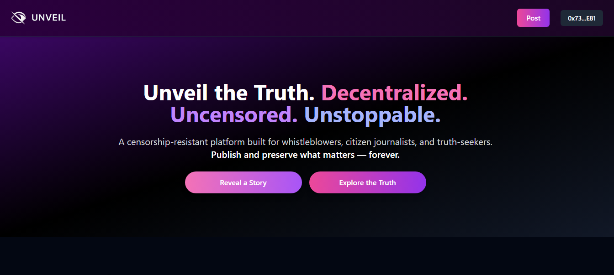
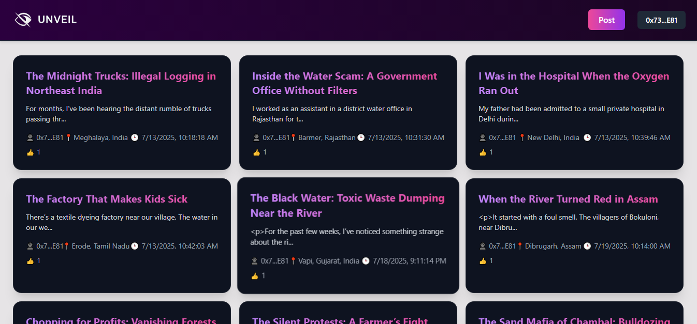
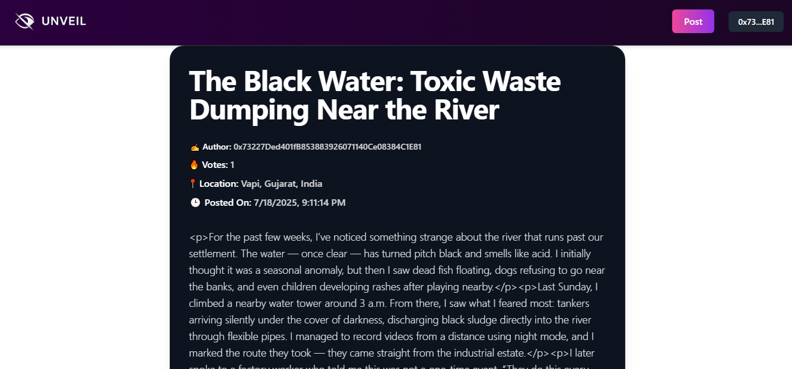

# 🕵️‍♂️ Unveil – Anonymous Whistleblowing Platform

Unveil is a decentralized platform designed to empower users to safely and anonymously report unethical or illegal activities. Built with IPFS and smart contracts, it ensures censorship-resistance, anonymity, and public accountability through community voting.

## 🌐 Live Demo

🔗 [https://unveil-orcin.vercel.app/](https://unveil-orcin.vercel.app/)

## 📽️ Demo Video

🎥 [Watch Demo video](https://youtu.be/CaLsUDHOVs8)

## ✨ Key Features

- 🕵️ Anonymous Reporting with address slicing toggle  
- 📦 IPFS storage for immutable censorship-resistant content  
- 🔗 On-chain data & voting using Solidity smart contracts  
- 🗳️ Vote on credibility of posts (upvote/downvote)  
- 📱 Mobile-first, accessible UI with TailwindCSS  
- 🌍 Live and deployed on BNB Testnet  

## 🔧 Tech Stack

- **Frontend**: React + TailwindCSS
- **Smart Contracts**: Solidity + Hardhat
- **Storage**: IPFS (via pinata.storage)
- **Interaction**: wagmi + rainbow kit
- **Chain**: BNB Testnet
- **Deployment**: Vercel (Frontend), BNB Testnet (Smart Contracts)

## 🧠 How It Works

1. Users submit a report (anonymity optional).
2. Post is uploaded to IPFS.
3. Post metadata (including IPFS hash) is stored on-chain.
4. Other users can view and vote on the report.
5. All data is publicly verifiable and immutable.

## 🖼️ Screenshots

### 🏠 Home page

### 📰 Feed

### 🔍 Full Post

## 📄 Smart Contract

- **Contract Name**: `Unveil`
- **Language**: Solidity `^0.8.30`
- **Deployed To**: BNB Testnet  
- **Explorer Link**: [View Contract on BSCScan](https://testnet.bscscan.com/address/0xc445076Ff5C3711eAC1F43efB252d0bFFD4Deaf2) 

## 🏆 Hackathon Submission

This project was built for the **[Tech Fairness Hackathon](https://www.hackquest.io/hackathons/Tech-Fairness-Hackathon)** and is being submitted under the following tracks:

### 🎯 Theme 1 – Break the Mold (FAIR3)

- **Track 1.1: Technological Fairness**
  - Empowering anonymous whistleblowing through censorship-resistant, privacy-preserving reporting and decentralized governance.

- **Track 1.3: BNB Chain Integration Special Award**
  - Leveraging BNB Chain for building a fairness-centric dApp with on-chain voting and transparent data integrity.